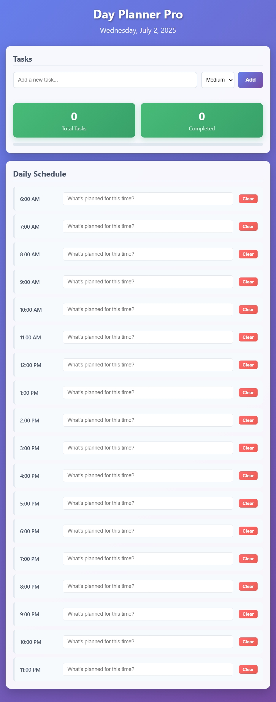

# Day Planner Pro

A modern, responsive web-based daily planner built with HTML, CSS, and JavaScript. Users can manage tasks throughout the day, save them to local storage, and track their progress efficiently.

## 🗓 Daily Planner Web App

A responsive, professional day planner built using HTML, CSS, and JavaScript.

## ✨ Features

* Plan your day from 6 AM to 11 PM
* Add tasks with priority levels (Low, Medium, High)
* Save tasks locally in the browser
* Real-time task tracking (Total / Completed)
* Hourly schedule management
* Clear individual time slots or all tasks
* Modern purple gradient interface
* Mobile-friendly responsive design

## 📦 Technologies Used

* HTML5
* CSS3
* JavaScript (Vanilla)
* LocalStorage API
* Responsive CSS Grid/Flexbox

## 📸 Preview



## 🚀 How to Use

1. Clone the repo or download ZIP
   ```bash
   git clone https://github.com/VishakhaGehlot/Day-Planner-Pro
   ```
2. Open `index.html` in your browser
3. Add tasks in the input field and click ➕ Add
4. Click on time slots to schedule activities
5. Use 🗑 Clear buttons to remove entries
6. Tasks are automatically saved to browser storage

## 📁 File Structure

```
day-planner-pro/
├── index.html
├── style.css  
├── script.js
└── README.md
```

## 🌐 Browser Support

* Chrome 60+
* Firefox 55+
* Safari 12+
* Edge 79+

## 📄 License

MIT License - feel free to use and modify!
